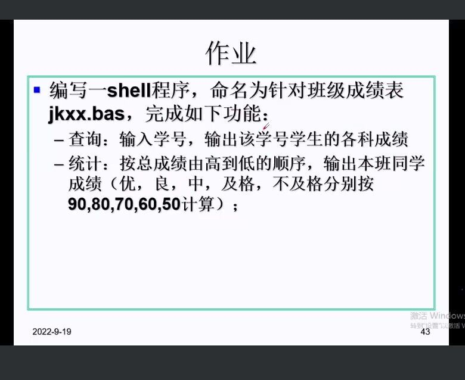
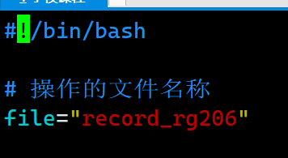
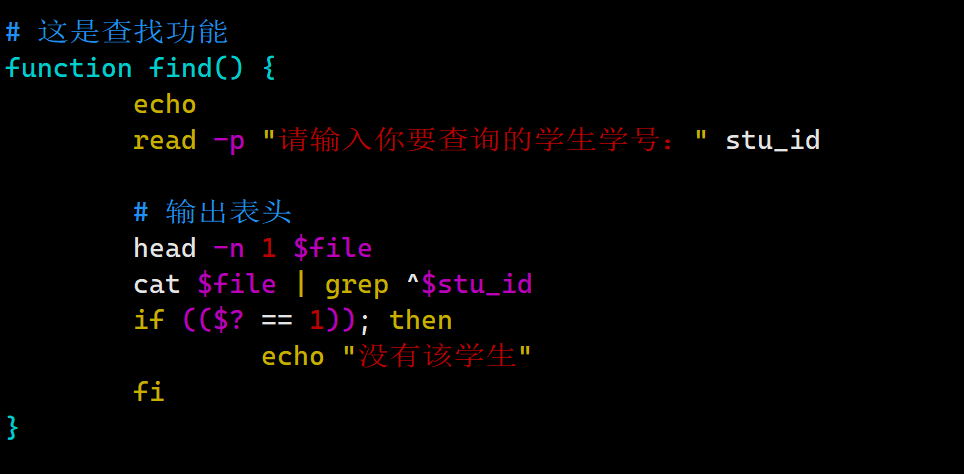
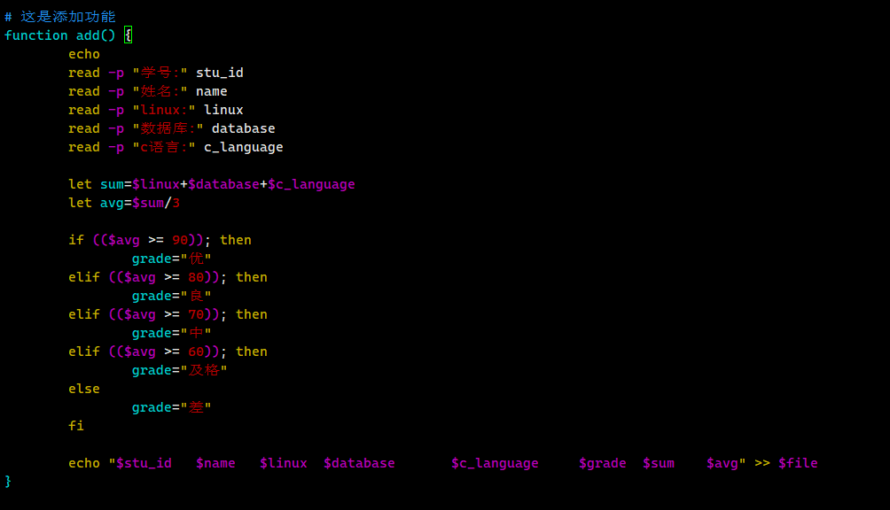
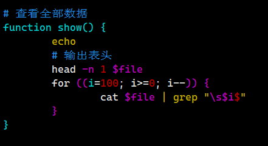
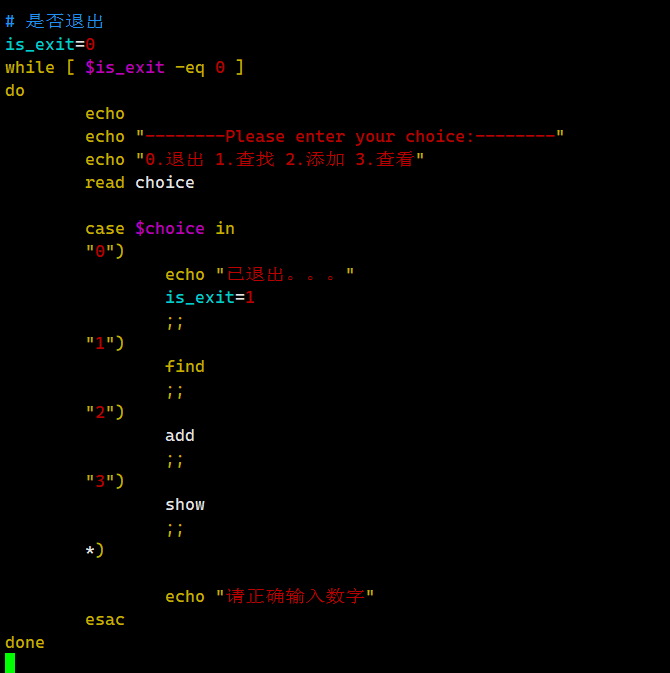
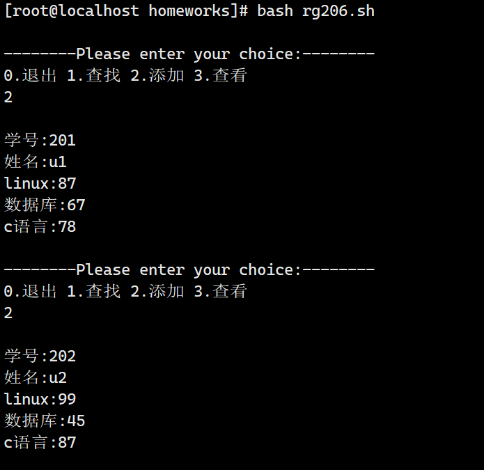
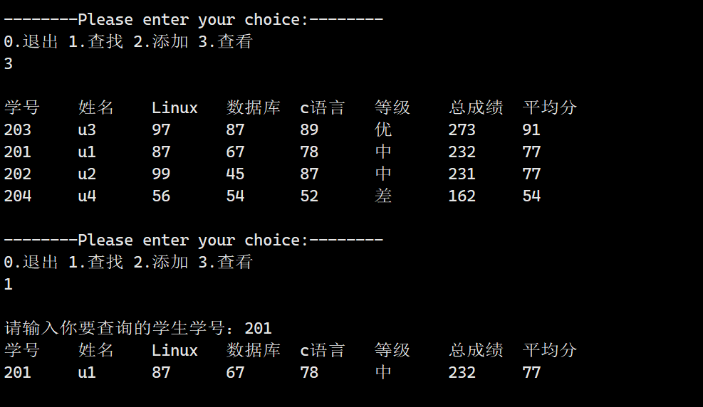
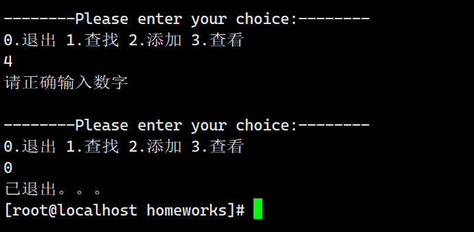

# 第三次作业

## 内容
  

## 步骤

1. 创建文件
   
   

2. 在记录文件record_rg206里添加表头
   

3. 在执行脚本rg206.sh里输入脚本
    - 定义全局变量，操作的文件名
      
    - 查找功能
      
    - 添加功能
      
    - 查看功能
      
    - 核心逻辑
      

4. 执行一下
   
   
   
   
